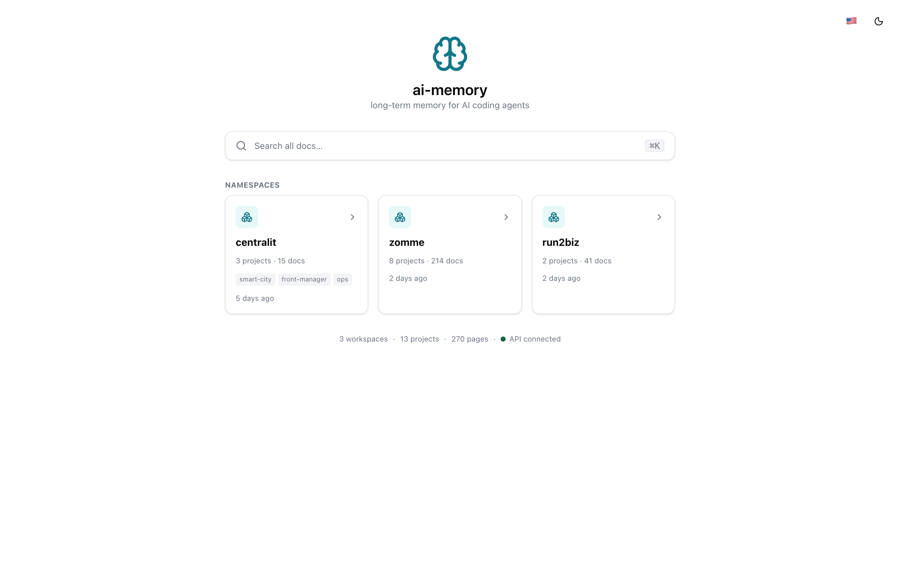
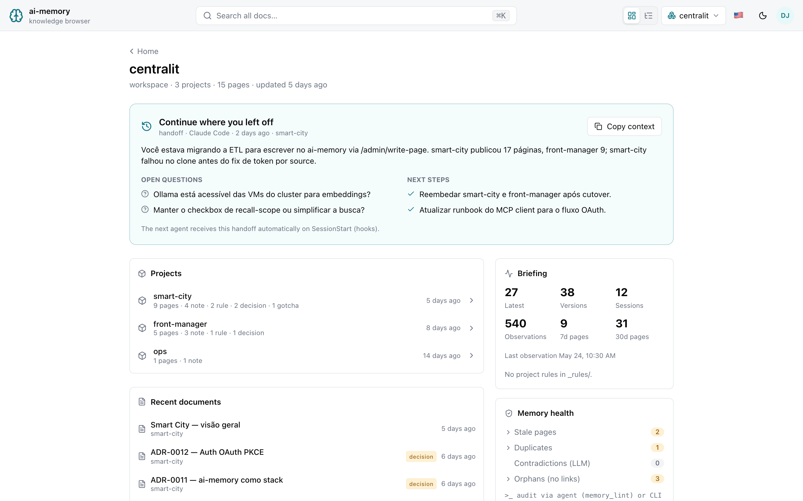
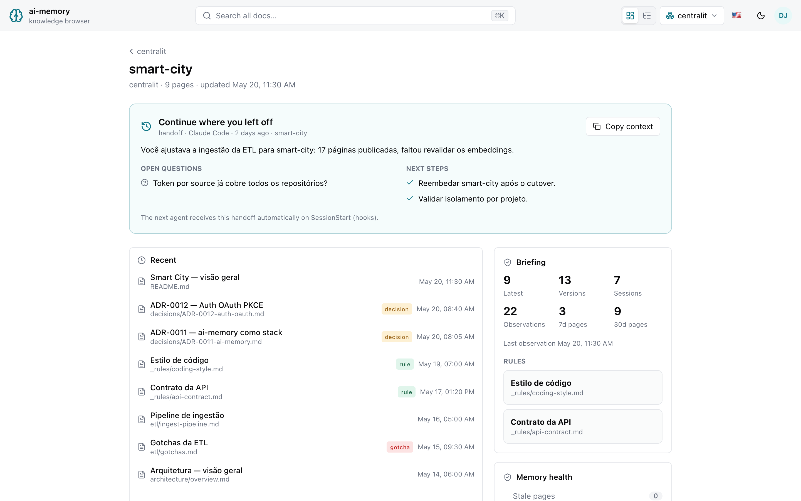
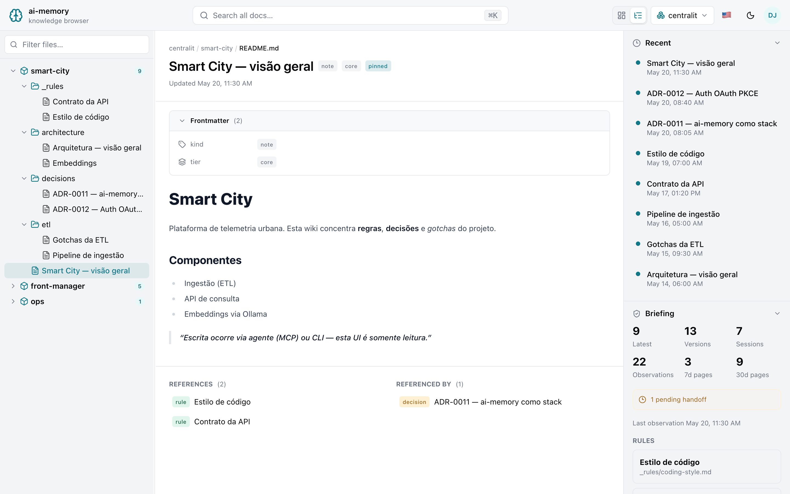
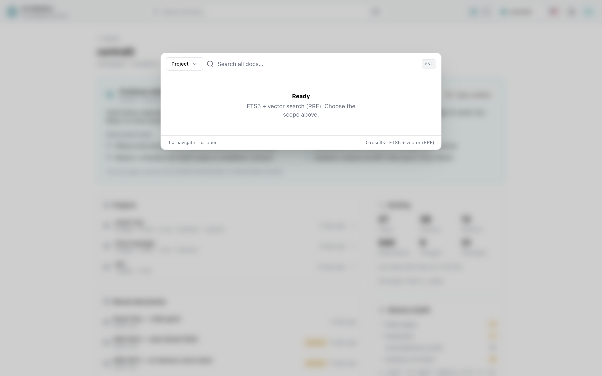

# ai-memory-ui

Custom SolidJS frontend for [`ai-memory`](https://github.com/akitaonrails/ai-memory) —
a read-only knowledge browser served by the server's `--web-ui-dir`, consuming
the same-origin `/api/v1` JSON API.

> Requires an `ai-memory` server with the read-only `/api/v1` frontend API and
> `--web-ui-dir` enabled.

## Screenshots

| Home (namespaces) | Workspace overview |
| --- | --- |
|  |  |

| Project overview | Document reader | Search palette |
| --- | --- | --- |
|  |  |  |

## Purpose

This app is a same-origin SPA for `ai-memory`:

- `/web` serves the built `dist/` directory (`--web-ui-dir`).
- `/api/v1` remains the only data source.
- The UI never reads SQLite or wiki files directly.
- MCP remains for agents; `/api/v1` is for browser frontends.

## Multi-scope model

The UI supports the workspace layout where each company/client can be a
workspace, while shared knowledge lives in separate workspaces such as
`practice/unit-testing` or `company/strategy`.

Search modes:

- `Project`: sends `GET /api/v1/search?q=...&workspace=...&project=...`.
- `Selected`: sends `POST /api/v1/search` with explicit scopes.
- `Global`: sends `GET /api/v1/search?q=...` and searches all latest pages.

Example selected-scope request:

```json
{
  "q": "unit test strategy",
  "limit": 12,
  "scopes": [
    { "workspace": "client-a", "project": "product" },
    { "workspace": "practice", "project": "unit-testing" }
  ]
}
```

This makes cross-project recall intentional. The frontend can combine a
client project with shared practice knowledge without broad global
search and without copying pages between workspaces.

## Stack

- SolidJS + TanStack Router (file-based) + TanStack Query
- Tailwind CSS v4 (`@tailwindcss/vite`) + Kobalte (solid-ui components)
- i18n via inlang Paraglide JS (`en` / `pt-BR` / `es`)

## Develop

```bash
npm install
npm run dev      # http://localhost:5173/web/
npm run build    # generates dist/ (runs i18n + route gen + tsc + vite)
```

Offline preview without a backend: `VITE_FIXTURES=1 npm run dev`.

### Branding

The header name/tagline are build-time env vars (default `ai-memory` /
`knowledge browser`):

```bash
VITE_APP_NAME="Knowledge Base" VITE_APP_TAGLINE="run2biz" npm run build
```

## Serve through ai-memory

```bash
ai-memory serve --transport http --bind 127.0.0.1:49374 \
  --enable-web --web-ui-dir /path/to/ai-memory-ui/dist
```

Then open `http://localhost:49374/web`.

The server is **multi-workspace**: `/web` and `/api/v1` browse every workspace in
the data dir. `--workspace`/`--project` are optional (default `default`) and only
name the workspace/project auto-created and used as the default for session
capture and MCP — they don't scope what the UI can see.

## Tests

```bash
npm run test:e2e   # Playwright (system Chrome), fixtures mode
```

Regenerate the screenshots above against a running server with data:

```bash
BASE=http://127.0.0.1:49374/web node scripts/screenshots.mjs
```
